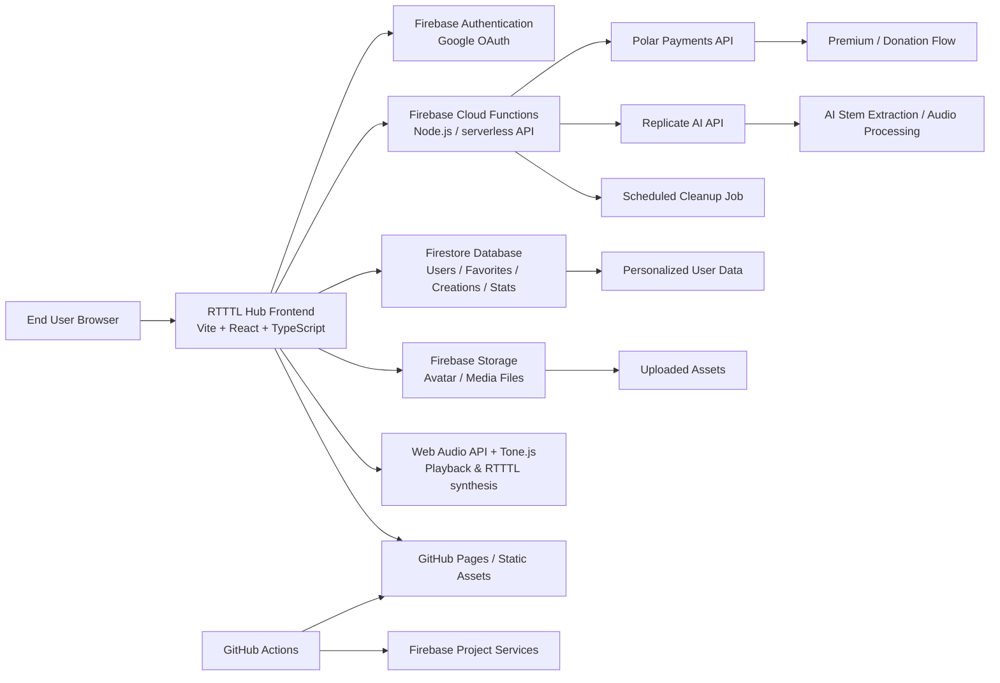

# RTTTL Hub System Architecture

This document describes the runtime environment, application architecture, front-end and back-end technology stack, cloud services, and integration patterns used by RTTTL Hub.

## 1. System Overview

RTTTL Hub is a browser-based music and ringtone platform focused on RTTTL (Ring Tone Text Transfer Language) collections, playback, authoring, user accounts, and cloud-synced creations. The platform combines a static front-end with Firebase-backed authentication, database, storage, and serverless functions for premium features and AI-assisted audio processing.

## 2. Runtime Environment

### Client Runtime
- Browser-based single-page application
- Modern web browsers: Chrome 110+
- JavaScript runtime: browser ECMAScript, no server-side rendering required
- Build tool: Vite
- Front-end framework: React 19 + TypeScript

### Server Runtime
- Firebase Cloud Functions (Node.js runtime, configured in the Firebase project)
- Admin SDK for privileged server-side access
- Scheduled jobs executed by Firebase Cloud Scheduler
- Local development environment via Firebase Emulators

### CI / Deployment Runtime
- GitHub Actions for automated build and deployment
- GitHub Pages for static front-end hosting
- Firebase Hosting/Project services used for app backend and authentication infrastructure

## 3. High-Level Architecture

## 4. Front-End Architecture

### Core Stack
- React 19
- TypeScript
- Vite
- React Router
- Zustand for client state management
- Tailwind CSS for styling
- CodeMirror for RTTTL editor experience
- Tone.js for real-time audio synthesis and transport
- Web Audio API for browser audio playback

### Front-End Responsibilities
- Display RTTTL music collections and category pages
- Manage search, filtering, favorites, and auth state
- Render the RTTTL editor and composition tools
- Play and schedule tones in the browser
- Sync user creations and favorites to Firestore
- Support user profile and premium workflow integration

### Front-End Data Patterns
- Local state with Zustand stores
- Browser persistence for user preferences and cached session state
- Firebase SDK clients for auth, Firestore, storage, and functions
- Environment variables injected at build time for Firebase configuration

## 5. Back-End and API Architecture

### Firebase Authentication
- Google OAuth via Firebase Auth
- User session tracking for signed-in users
- Auth state stored and observed in the client
- Used for protected actions and account-based personalization

### Firestore Database
The application uses Firestore as the transactional data layer for:
- Users
- Favorites
- Created RTTTL content
- Track statistics
- User interactions and activity history
- Premium / donation transaction tracking

### Firebase Storage
- Stores user-uploaded media, avatar content, and asset files
- Used for persistence of uploaded or generated content that should not be kept only in local state

### Cloud Functions
The backend is implemented with Firebase Cloud Functions v2 and includes:
- Payment session creation via Polar
- Webhook processing from Polar
- AI inference orchestration with Replicate
- Scheduled deletion workflow for pending account cleanup

These functions keep API secrets server-side and avoid exposing sensitive credentials in the client bundle.

## 6. Cloud and External Services

### Firebase
Primary cloud platform used for application infrastructure:
- Firebase Authentication
- Firestore
- Cloud Storage
- Cloud Functions
- Firebase Emulators for local development

### GitHub Pages
- Hosts the static front-end assets for the public web app
- Deployed through GitHub Actions

### Polar
- Handles donation and premium purchasing flows
- Uses checkout sessions and webhook verification
- Premium status is written back into Firestore by the server-side webhook handler

### Replicate
- External AI service used for audio processing workflows
- Server-side proxy avoids exposing the API token in the browser
- Used for model inference tasks such as stem extraction or audio transformation

### GitHub Actions
- Runs install, lint, sitemap validation, and production build
- Publishes the built front-end to GitHub Pages

## 7. Application Data Flow

### User Login Flow
1. User opens the app in browser.
2. Front-end initializes Firebase Auth.
3. User signs in with Google OAuth.
4. Client reads and updates user records in Firestore.
5. Protected features become available based on auth state.

### Music Playback Flow
1. User selects a track or collection from the front-end.
2. Front-end parses RTTTL content and loads playback metadata.
3. Tone.js and Web Audio API synthesize audio in the browser.
4. Timeline and waveform UI update in real time.

### Creation / Sync Flow
1. User creates or edits a RTTTL composition.
2. Client stores drafts locally and syncs state to Firestore when applicable.
3. User profile and favorites are persisted to the cloud.
4. Data can be recalled across sessions.

### Premium / Donation Flow
1. User initiates a donation or premium purchase.
2. Front-end requests a checkout session from Firebase Cloud Function.
3. Function creates a secure Polar checkout session.
4. Polar redirects the user to checkout.
5. Webhook confirms successful payment.
6. Server updates Firestore premium status for the user.

### AI Processing Flow
1. User submits audio for AI-assisted processing.
2. Browser sends the request to a protected Cloud Function.
3. Function proxies the model request to Replicate.
4. Function polls prediction status and returns results.
5. Front-end renders the output or updates the audio workflow.

## 8. Security Model

- Firebase rules constrain database and storage access
- Sensitive tokens and API keys are held as server-side secrets in Firebase Functions
- Client bundles do not include private backend credentials
- Auth-required functions validate user identity before executing sensitive operations
- Payment webhooks are verified using shared secret validation

## 9. Development & Local Workflow

### Local Development
- Vite development server for the front-end
- Firebase Emulators for local Firestore/Auth/Storage testing
- Environment-based toggling between emulator and production Firebase services

### Production Deployment
- Static front-end built and deployed through GitHub Pages
- Firebase services remain in the cloud project for data, auth, and function execution

## 10. Summary

RTTTL Hub is a hybrid web architecture built around a React front-end, Firebase cloud services, and serverless backend functions. It combines a lightweight static web app with real-time browser audio processing, cloud user data, secure payment integration, and external AI processing, making it a modern browser-first platform for RTTTL music collection and composition.
